# 🚀 Complete Python Development Guide: uv + pyproject.toml + LangGraph

> **📚 Comprehensive Reference**: A complete guide to modern Python development workflow using uv package manager, pyproject.toml configuration, and LangGraph agent building.

---

## 📋 Table of Contents

- [🚀 Complete Python Development Guide: uv + pyproject.toml + LangGraph](#-complete-python-development-guide-uv--pyprojecttoml--langgraph)
  - [📋 Table of Contents](#-table-of-contents)
  - [⚡ uv Package Manager Workflow](#-uv-package-manager-workflow)
    - [🔧 Project Setup](#-project-setup)
    - [📥 Installation Process](#-installation-process)
    - [🔄 Environment Synchronization](#-environment-synchronization)
    - [📄 Configuration Management](#-configuration-management)
    - [📦 Dependency Management](#-dependency-management)
    - [🏠 Virtual Environment Setup](#-virtual-environment-setup)
    - [✅ Code Quality Tools](#-code-quality-tools)
    - [📦 Package Distribution](#-package-distribution)
    - [🏷️ Package Naming Convention](#️-package-naming-convention)
    - [📂 Code Import Configuration](#-code-import-configuration)
    - [⚙️ Tool Configuration](#️-tool-configuration)
    - [🧪 Test File Management](#-test-file-management)
    - [🔄 Complete Development Workflow](#-complete-development-workflow)
  - [🔧 Additional Development Notes](#-additional-development-notes)
  - [🤖 LangGraph Agent Building Guide](#-langgraph-agent-building-guide)

---

## ⚡ uv Package Manager Workflow

### 🔧 Project Setup

**uv** is a modern Python package manager that revolutionizes the development workflow:

- **⚡ Performance**: 10-100x faster package installation compared to pip
- **🎯 Purpose**: Manages packages and virtual environments automatically
- **🔄 Replaces**: Traditional `pip + venv` workflow
- **🛡️ Reliability**: More reliable dependency resolution than pip

### 📥 Installation Process


curl -LsSf https://astral.sh/uv/install.sh | sh


**Command Breakdown:**
- `curl` = Download files from the internet
- `-L` = Follow redirects (if the URL redirects to another URL)
- `-s` = Silent mode (don't show progress bars)
- `-S` = Show errors even in silent mode
- `-f` = Fail silently on HTTP errors
- `https://astral.sh/uv/install.sh` = URL to download the installer
- `|` = Pipe operator
- `sh` = Execute the downloaded script

> **⚠️ Important Note**: Before creating the environment, perform a `git clone` for your code repository.

### 🔄 Environment Synchronization

```bash
uv sync
```

**What it does:**
- Installs packages and creates virtual environment
- Equivalent to `pip install -r requirements.txt`
- Reads from `pyproject.toml` configuration

### 📄 Configuration Management

**pyproject.toml** serves as the blueprint for the project:

- **📋 Definition**: "Tom's Obvious Minimal Language" (TOML) config file format
- **📦 Contains**: Required packages, optional packages, project info, tool settings

**🆚 Advantages over YAML:**
- ✅ No indentation sensitivity
- ✅ Simple, clear syntax
- ✅ Official Python standard (PEP 518)
- ✅ Robust error handling (one problem doesn't break everything)

### 📦 Dependency Management

```toml
[project]
dependencies = [
    "requests",
    "pandas"
]

[project.optional-dependencies]
dev = [
    "pytest",
    "mypy",
    "ruff"
]
```

**Dependency Types:**
- **`dependencies = []`**: Must-have packages to run your code
- **`optional-dependencies.dev = []`**: Extra packages only for development

**💡 Example**: You need `requests` to run your application, but `pytest` only for testing.

### 🏠 Virtual Environment Setup

**Process Flow:**
1. `uv sync` reads `pyproject.toml`
2. Creates `.venv/` folder with all packages installed
3. Results in isolated environment for your project

**Additional Commands:**
- `touch .env` = Creates an empty environment file

### ✅ Code Quality Tools

#### 🔍 MyPy - Type Checking
**Purpose**: Finds type errors before code runs

```python
def add_numbers(a: int, b: int) -> int:
    return a + b

# This will throw an error:
add_numbers("5", "10")  # ❌ Expects integers, got strings
```

#### 🎨 Ruff - Code Formatting & Linting
**Purpose**: Fixes formatting, finds unused imports, sorts code

```bash
ruff check src/ --fix
```

**Command Breakdown:**
- `ruff check src/` = Check all files in src/ folder
- `--fix` = Automatically fix formatting issues

**Example**: Catches `add_numbers("5", "10")` when expecting integers

### 📦 Package Distribution

**Key Components:**
- **setuptools**: Tool that packages your code for sharing
- **wheel (.whl)**: Zip file format for Python packages
- **build_meta**: The engine inside setuptools that performs the packaging work

### 🏷️ Package Naming Convention

**Format**: `name-version-python-abi-platform.whl`

**Example**: `myproject-1.0.0-py3-none-any.whl`

**Component Breakdown:**
- `py3` = Python 3 compatible
- `none` = No compiled code, which means its only Python code
- `any` = Works on any platform

### 📂 Code Import Configuration

**Configuration Options:**
- `packages = ["your_project"]` = Makes `from your_project import X` work
- `package-dir` = Points to where your source code lives
- `py.typed` = Tells other tools "this package has type hints"

### ⚙️ Tool Configuration

```toml
[tool.ruff]
lint.select = ["E", "F", "I"]  # Which rules to enforce
lint.ignore = ["E501"]         # Which rules to skip
```

**Settings:**
- `lint.select` = Which rules to enforce (spacing, imports, docs)
- `lint.ignore` = Which rules to skip

### 🧪 Test File Management

**Special Rules for Test Files:**
- `"tests/*"` = Apply special rules for test files
- **Skip docs** = Test files don't need documentation
- **Allow older syntax** = Tests can use simpler code patterns

### 🔄 Complete Development Workflow

```mermaid
graph TD
    A[📝 Write pyproject.toml] --> B[🔄 Run uv sync]
    B --> C[🏠 Creates .venv/ + installs packages]
    C --> D[⚡ Activate environment]
    D --> E[💻 Write code in src/your_project/]
    E --> F[✅ Run ruff and mypy]
    F --> G[📦 Build package → .whl file]
```



**Step-by-Step Process:**
1. 📝 Write `pyproject.toml` with dependencies
2. 🔄 Run `uv sync` → creates `.venv/` and installs packages
3. ⚡ Activate environment → `source .venv/bin/activate`
4. 💻 Write code in `src/your_project/`
5. ✅ Run `ruff` and `mypy` to clean code
6. 📦 Build package → creates `.whl` file for distribution

---

## 🔧 Additional Development Notes

### 💻 macOS Development Tips

<details>
<summary>🔍 <strong>Hidden Files Management</strong></summary>

On macOS, `.env` files are hidden by default:
- **Terminal**: Use `ls -la` to see hidden files
- **Finder**: Press `Cmd + Shift + .` to toggle showing hidden files

</details>

### 📋 Configuration File Preferences

> **💡 Key Insight**: `uv` uses `pyproject.toml` instead of `requirements.txt` for modern Python project management.

### 📦 Project Metadata Deep Dive

#### 🥚 .egg-info/ Directory
- **🎯 Purpose**: Tells Python "this folder IS a package that can be imported"
- **📋 Contains**: Information ABOUT your local project (not external packages)
- **🔧 Function**: `uv` installs YOUR project (e.g., `src/deep_research_from_scratch/`) as a package

#### 🛠️ Build Tools Ecosystem

**setuptools** - A comprehensive tool that converts Python code into distributable packages:
below is the flow of how setuptools works:

```mermaid
graph LR
    A[📄 pyproject.toml] --> B[🔍 Read config]
    B --> C[📁 Find .py files in src/]
    C --> D[📋 Copy to temp folder]
    D --> E[📝 Add metadata]
    E --> F[📦 Create .whl file]
    F --> G[✅ Package ready]
```



**Component Breakdown:**
- **wheel**: The format for the zip file
- **build**: The tool that creates the .whl file
- **build_meta**: Contains the actual code that converts Python files into distributable packages

**build_meta Process:**
1. 📄 Read your `pyproject.toml`
2. 🔍 Find all `.py` files in `src/`
3. 📋 Copy them into a temporary folder
4. 📝 Add metadata (name, version, dependencies)
5. 📦 Create a `.whl` file
6. ✅ Return the `.whl` file as your package

**📁 .dist-info/**: Contains metadata about your package (version, author, etc.)

**🎯 Why You Need This:**
- 🤝 Share your code with others
- 🌐 Publish your code to PyPI
- 🔄 Use your code in other projects

### 🎨 Advanced Ruff Configuration

```toml
[tool.ruff.lint]
select = ["E", "F", "I", "D", "UP"]
ignore = ["D100", "D104"]

[tool.ruff.lint.per-file-ignores]
"tests/*" = ["D", "UP"]  # Skip documentation for test files

[tool.ruff.lint.pydocstyle]
convention = "google"  # Use Google docstring format
```

**Lint Rule Explanations:**
- **`"D"`** = `pydocstyle` - Checks if code has proper documentation
- **`"UP"`** = `pyupgrade` - Checks for outdated syntax patterns
- **`"tests/*" = ["D", "UP"]`** = Skip documentation requirements for test files

### 🔍 Type Systems Comparison

#### 🆚 Pydantic vs Type Hints

<details>
<summary>📊 <strong>Detailed Comparison</strong></summary>

| Feature | Type Hints | Pydantic |
|---------|------------|----------|
| **Import** | `from typing import List, Dict` | `from pydantic import BaseModel, Field` |
| **Enforcement** | ❌ Just hints - Python doesn't enforce | ✅ Runtime validation and enforcement |
| **Use Case** | Static type checking | Data validation and settings management |
| **Best For** | Code documentation and IDE support | APIs, configuration files, complex data structures |

**💡 Key Difference**: Type hints are just suggestions - Python doesn't enforce them, whereas Pydantic provides runtime validation.

</details>

#### 🎨 Rich Python Library

**Rich** - Beautiful terminal formatting library:

```python
from rich import print
from rich.console import Console
from rich.table import Table

# Basic usage
print("Hello, [bold red]World![/bold red]")

# Advanced usage
console = Console()
table = Table(title="Star Wars Movies")
table.add_column("Released", justify="right", style="cyan")
table.add_column("Title", style="magenta")
console.print(table)
```

**🎯 Purpose**:
- 🎨 Rich text and beautiful formatting in the terminal
- 📊 Classes and functions for styling text, tables, and output
- ✨ Pretty-printing and formatting terminal output

---
## 🤖 LangGraph Agent Building Guide

> **🎯 Project Focus**: Building intelligent research agents that can scope, research, and report on complex topics.

### 🏗️ Agent Architecture Overview

The agent building process follows a structured workflow:

```mermaid
graph LR
    A[🎯 Define Scope] --> B[🔍 Research] --> C[📝 Write Report]
    B --> D[📊 Update State]
    D --> C
```



**Core Workflow:**
1. **🎯 Define Scope** - Determine what needs to be researched
2. **🔍 Research** - Gather information and findings
3. **📝 Write Report** - Compile findings into comprehensive output

### 🧠 State Management Architecture

#### 🔄 Shared Memory Concept

**STATE** serves as shared memory between agent layers/phases:

> **💡 Example**: For a healthcare AI impact project:
> - **Scope Phase**: Defines research parameters
> - **Research Phase**: Calls state to understand scope, conducts research, updates findings
> - **Writing Phase**: Uses state to compile final report

### 📝 Jupyter Development Workflow

#### %%writefile Magic Command

```python
%%writefile src/deep_research_from_scratch/state_scope.py
# Cell contents are written to file which helps to call this py into any other notebook
```

**Usage Pattern:**
```python
# Import the created file
from src.deep_research_from_scratch.state_scope import *
```

### 📨 LangChain Message System

#### 🏗️ BaseMessage Foundation

```python
from langchain_core.messages import BaseMessage
```

**🎯 Purpose**: Standardizes conversation representation in LangChain which can be used for any or most of the mdoel types

**✅ Benefits:**
- **Consistent Message Format**: All messages have uniform structure (`role`, `content`, etc.)
- **Structured Access**: `message.content`, `message.type`, `message.role`

#### 📋 Message Type Hierarchy

```python
from langchain_core.messages import (
    HumanMessage,
    AIMessage,
    SystemMessage,
    ToolMessage
)

# Message examples
HumanMessage(content="What is AI?")           # 👤 User input
AIMessage(content="AI is...")                # 🤖 LLM response
SystemMessage(content="You are helpful...")  # ⚙️ System instructions
ToolMessage(content="Search results...")     # 🔧 Tool outputs
```

### 🗂️ State Management Classes

#### 📦 MessagesState Container

```python
from langgraph.graph import MessagesState
```

**🎯 Purpose**: Container that manages conversation state, works as `Memory`
- **📚 Structure**: Dictionary containing all conversation messages
- **🔄 Access Pattern**: Each agent reads from `state["messages"]` and adds new messages

#### 🔧 Message Handling

```python
from langgraph.graph import add_messages
```

**🎯 Purpose**: to handle messages in langraph, adds new messages and keeps a track of the conversation history

**🧠 Smart Features:**
- **🚫 Deduplication**: Prevents duplicate messages
- **📊 Ordering**: Maintains chronological message sequence
- **🔄 Updates**: Handles message modifications intelligently
- **🔀 Merging**: Combines messages without simple overwriting

### 🏗️ Custom State Architecture

#### 📥 AgentInputState

```python
class AgentInputState(MessagesState):
    """Handles initial user input and requirements- lets say a user question"""
    pass
```

**🎯 Purpose**: Captures user questions and initial requirements


#### 🧠 AgentState - Core State Management

```python
class AgentState(MessagesState):
    """Extended state management for research workflow, this is where the memory is maintained betwen AI and users"""
    research_brief: str          # 🎯 Focused research question
    supervisor_messages: List    # 💬 Internal agent communication
    raw_notes: str              # 📝 Unprocessed research findings
    notes: str                  # ✅ Cleaned/processed findings
    final_report: str           # 📊 Final output document
```

**🔧 State Components:**
- **`research_brief`**: The focused research question generated from user input
- **`supervisor_messages`**: Internal agent-to-agent communication
- **`raw_notes`**: Unprocessed research findings
- **`notes`**: Cleaned and processed research findings
- **`final_report`**: The final output document

---
### 🏗️ LangGraph Core Components

#### 🔧 Fundamental Building Blocks

```mermaid
graph TD
    A[🔧 Nodes] --> B[🧠 State]
    B --> C[🔀 Control Flow]
    C --> D[🔗 Edges]
    D --> E[📊 Graph]
    E --> F[⚡ Execution]
```

<details>
<summary>🧩 <strong>Core Component Overview</strong></summary>



</details>

1. 🔧 Nodes - Individual Workers

```python
def research_node(state: AgentState) -> AgentState:
    """Example node that performs a task"""
    # Receives state aka task, does work, returns updated state
    return updated_state
```

**🎯 Purpose**: Individual workers that perform specific tasks
- **📥 Input**: Receives current state or ask from the user
- **⚙️ Processing**: Performs designated work
- **📤 Output**: Returns updated state

2.  🧠 State - Shared Memory [ this is the memory part in Langgraph]

**🎯 Purpose**: Shared memory that flows between nodes

**📦 Contains**:
- 💬 Messages and conversation history
- 🔍 Research findings and data
- 📊 Reports and processed information
- 🔄 Workflow metadata

3. 🔀 Control Flow - Decision Logic - <FONT COLOR ="BLUE"> THIS IS VERY IMPORTANT AS THIS IS WHERE THE DECISION MAKING HAPPENS</FONT>

**🎯 Purpose**: Determines which node runs next based on current state

    3.1 **🔀 Flow Types**:

<details>
<summary>📋 <strong>Conditional Edges</strong></summary>

**Example**: "If research is done, go to writing"
- this flow type is more explicit, will need more if then else statement and we will have completely separate routing function that runs after the node completes i.e. first task completes like do a research if not found then triggers another if then else function. 
Post this, The node just updates state- aka **MEMORY**, then the routing function decides next steps based on that updated state.

</details>

<details>
<summary>🎛️ <strong>Router Functions</strong></summary>


**Example**: Supervisor analyzes state and routes to appropriate node
-- In router we will need to invoke the LLM to decide the next step so there could be multiple LLM calls & LLM decides the reasoning

</details>


<details>

<summary>📏 <strong>Linear Flow</strong></summary>

```python
# Predetermined sequence
Node1 → Node2 → Node3 → End
```
**Example**: Fixed sequence of operations

</details>

#### ⚡ Command Flow - Explicit Control we use keyword "Command"


```python
from langgraph.graph import Command

def node_with_command(state):
    # Process state
    return Command(
        goto="next_node",           # Which node to go to next
        update={"key": "value"}     # State changes to make
    )
```

**🆚 vs Conditional Edges**:
- **Command Flow**: Explicitly specifies both routing AND state updates in one step
- **Conditional Edges**: Returns state updates, then edges decide routing separately.
- **Both are if then else**: but in Command routing, Logic inside the node function, Node decides and routes in one step whereas 
conditional edges, logic is outside the node function, node returns state updates, then edges decide routing separately.
    - for more complex decisions, we can use conditional edges and router functions as router takes llm's knowledge whereaas in 
    conditonal edges, we can use another if then else to decide the next step.

**In Our Code In Scope Notebook, we use Command Flow**
    - def clarify_with_user(state) -> 
  Command[Literal["write_research_brief", "end"]]:  else:
          return Command(
              goto="write_research_brief",  # Route to 
  next node

4. 🔗 Edges - Node Connections
    - connects one node to another code 

**🎯 Purpose**: Define possible transitions between nodes
- **📍 Fixed Edges**: Direct connections (A → B)
- **🔀 Conditional Edges**: Dynamic routing based on state
- **🎛️ Router Edges**: Supervisor-controlled routing

5. 📊 Graph - Workflow Structure


**🎯 Purpose**: Overall workflow structure connecting nodes with edges
- **🏁 START**: Entry point of the workflow
- **🏁 END**: Exit point of the workflow
- **🔗 Connections**: Define valid transitions between nodes

#### ⚡ Execution Flow

```mermaid
graph LR
    A[🏁 START] --> B[🔧 Node processes state]
    B --> C[📊 Updates state]
    C --> D[🔀 Control flow decides next]
    D --> E[🔧 Next node]
    E --> F[🏁 END condition?]
    F -->|No| B
    F -->|Yes| G[🏁 END]
```



**🔄 Process**:
1. **🏁 Start** - Initialize workflow
2. **🔧 Node Processing** - Current node processes state
3. **📊 State Update** - Node returns updated state
4. **🔀 Control Decision** - Flow logic determines next node
5. **🔄 Repeat** - Continue until end condition met

---

### 🎯 Practical Implementation - Scoping Workflow

    --  🤔 clarify_with_user Node- we used Command routing in scope notebook

        **🎯 Purpose**: First decision node that determines if user provided sufficient information

```python
def clarify_with_user(state: AgentState) -> Command:
    """Determines if clarification is needed from user"""

    # Force structured output format
    structured_output_model = model.with_structured_output(ClarifyWithUser)

    # Process user conversation history
    response = structured_output_model.invoke([
        HumanMessage(content=clarify_with_user_instructions.format(
            messages=get_buffer_string(messages=state["messages"]),
            date=get_today_str()
        ))
    ])

    # Return routing command
    if needs_clarification:
        return Command(goto="END")
    else:
        return Command(goto="write_research_brief")
```

**🔧 Key Components**:
- **📥 Input**: Current state (`AgentState`)
- **📤 Output**: `Command` routing to either `"write_research_brief"` or `END`
- **🏗️ Structured Output**: Forces model output to match `ClarifyWithUser` class format
- **💬 Context**: Sends user conversation history to LLM for decision making
- **📅 Temporal Context**: Uses `get_today_str()` for current date context

#### 📝 write_research_brief Node

    - **🎯 Purpose**: Generates focused research question from user input

<details>
<summary>🔧 <strong>Message Buffer Processing</strong></summary>

6.  📋 get_buffer_string Function

```python
from langchain_core.messages import get_buffer_string

# Input: List of message objects
messages = [
    HumanMessage("How does AI affect healthcare?"),
    AIMessage("I need more details...")
]

# Output: Readable conversation text
buffer = get_buffer_string(messages=messages)
```

**📤 Output Format**:
```
Human: How does AI affect healthcare?
AI: I need more details...
```

**🎯 Purpose**: Transforms message objects into readable conversation text that LLMs can process effectively

</details>

---

7.  🏗️ Graph Construction Process

#### 📊 Graph Initialization

```python
from langgraph.graph import StateGraph, START, END

# Create the graph builder
deep_researcher_builder = StateGraph(
    AgentState,                    # Internal state management
    input_schema=AgentInputState   # Initial input format
)
```

**🎯 Purpose**:
- **🧠 Internal State**: Uses `AgentState` for workflow state management
- **📥 Input Schema**: Accepts `AgentInputState` as initial input format
- **🏗️ Builder Pattern**: Creates empty graph ready for node and edge addition

#### 🔧 Node Registration

```python
# Register workflow nodes
deep_researcher_builder.add_node("clarify_with_user", clarify_with_user)
deep_researcher_builder.add_node("write_research_brief", write_research_brief)
```

**🎯 Purpose**: Registers functions as executable workflow steps
- **🏷️ Node Names**: String identifiers for routing
- **⚙️ Functions**: Actual processing logic for each step

8.  🔗 Edge Configuration

```python
# Define workflow connections
deep_researcher_builder.add_edge(START, "clarify_with_user")      # Entry point
deep_researcher_builder.add_edge("write_research_brief", END)     # Exit point
```

**🔀 Flow Definition**:
- **🏁 START → clarify_with_user**: Workflow entry point
- **📝 write_research_brief → END**: Workflow exit point

9.  ⚡ Graph Compilation

```python
# Compile into executable workflow
deep_researcher = deep_researcher_builder.compile()
```

**🎯 Purpose**:
- **🔧 Compilation**: Transforms graph definition into executable workflow
- **📞 Callable**: Returns function that can be invoked to run the workflow
- **✅ Validation**: Ensures graph structure is valid and complete

### 📊 Complete Workflow Visualization

```mermaid
graph TD
    A[🏁 START] --> B[🤔 clarify_with_user]
    B -->|📋 Command routing| C{🔍 Needs clarification?}
    C -->|✅ Yes| D[🏁 END - Request clarification]
    C -->|❌ No - Info sufficient| E[📝 write_research_brief]
    E --> F[🏁 END - Brief created]

```



**🎯 Decision Points**:
- **🤔 clarify_with_user**: Analyzes user input sufficiency
- **🔀 Command Routing**: Dynamic routing based on analysis results
- **📝 write_research_brief**: Generates focused research question
- **🏁 END**: Workflow completion with appropriate output

---


10. Distinction between graph/ edge and nodes: 
        Graph and edges come into play during execution, not decision-making.
        Who does what:
        The NODE (clarify_with_user) = The decision maker

        Analyzes user input
        Uses LLM to decide if clarification needed
        Makes the routing decision via Command

        The GRAPH + EDGES = The execution framework

        Provides the possible pathways
        Enforces the routing decisions
        Actually moves execution from node to node

        During execution:

        Graph starts execution at START
        Fixed edge routes to clarify_with_user node
        Node makes the decision (need clarification or not?)
    Node returns Command with routing choice
    Graph reads the Command and follows the specified route
    Graph moves execution to END or write_research_brief

    The node decides, the graph executes the decision.

# Complete flow of how OVERALL LANGGRAPH WORKS: 
    - Nodes are individual functions that perform specific tasks or decisions
    - State is a structured dictionary containing messages, research data, and workflow status. **MEMORY**
    - State grows throughout workflow execution within model context limits
    - Graph defines the visual flow and possible pathways between nodes
    - Fixed edges create predetermined connections between nodes - no decision making involved
    - using Command or conditional logic we enable dynamic routing based on state/ memory
    - Graph builder creates the structure but requires compilation to become executable
    - Compiled graph can be invoked with initial state to start workflow execution     

## <font color = "Orange">The most part is to decide how to make a decision: </font>
    - as stated above it can be either Conditional edge, or routing, command routing or linear where 
    we used command routing in this notebook using the keyword "Command"
    - routing function will need to invoke multiple llm calls to make a decision no dependency on if then else 
    - - **Both are if then else**: but in Command routing, Logic inside the node function, Node decides and routes in one step whereas 
conditional edges, logic is outside the node function, node returns state updates, then edges decide routing separately.
    - for more complex decisions, we can use conditional edges and router functions as router takes llm's knowledge whereaas in 
    conditonal edges, we can use another if then else to decide the next step.

11. from langgraph.checkpoint.memory import InMemorySaver
    - in this notebook they use InMemorySaver to save the state of the workflow in memory. 
    - Required for human-in-the-loop workflows where agent waits for user input
    - In production, we would use a database or other persistent storage solution
    - Simple implementation for development and testing
    - for robust we need to use database. example we could use s3 to store our data or files and DynamoDB to store our state/ memory with enforced schema. 
    - checlpoint basically is captures where you are, what you've done, and what data you have so you can resume from that exact point later.
    - scope = deep_researcher_builder.compile()  # Ready to run the agent/workflow

12. Langgraph Json : __langgraph.json__ is a configuration file for LangGraph deployment and development:
    - Purpose:
        - Maps graph names to their file locations for easy reference
        - Specifies Python version and environment requirements
    - Benefits:
        - Run graphs by name: langgraph run scope_research
        - Deploy specific graphs without knowing file paths
